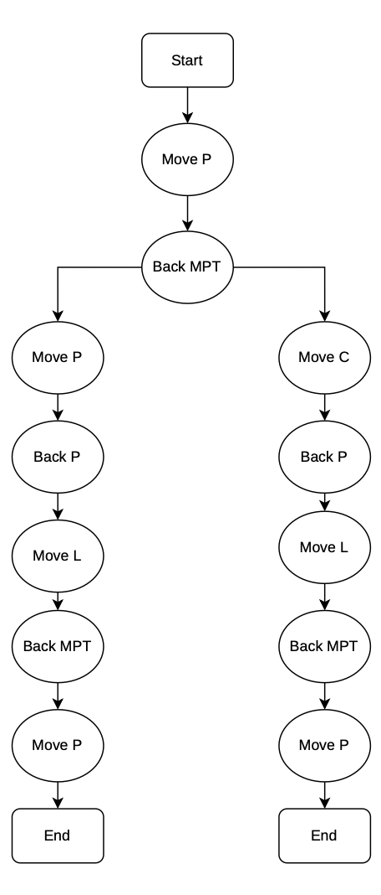
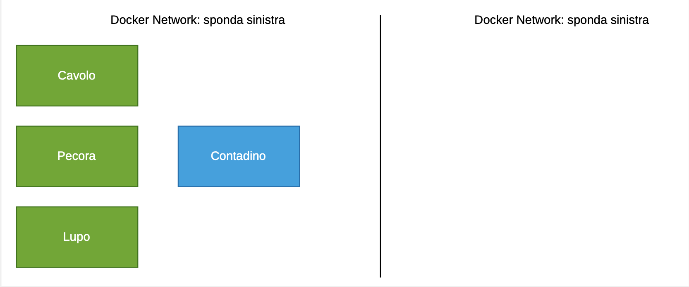
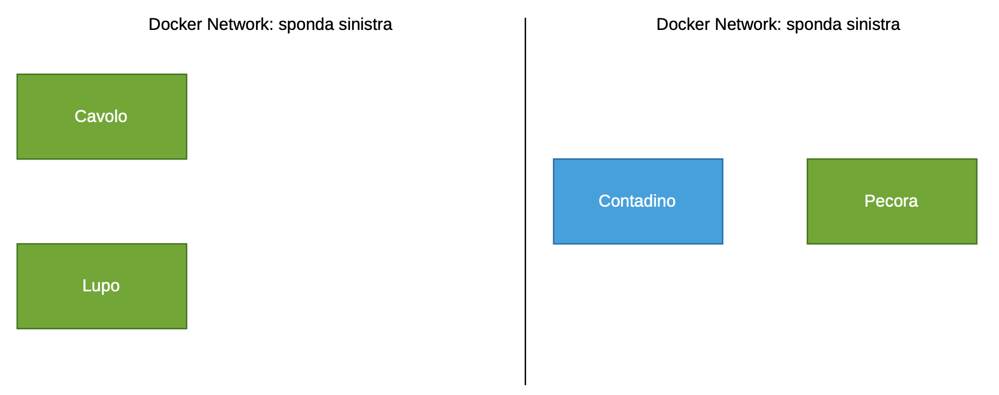

<h1 align="center">Problema del Lupo-Pecora-Cavolo</h1>

### Definizione Problema

Un contadino deve attraversare un fiume portando con se una pecora, un cavolo e un lupo. 

### Vincoli Problema 

Questo problema ha tre vincoli importanti:

- se lasciato da solo con la pecora, il lupo la mangia
- se lasciata da sola con il cavolo, la pecora lo mangia
- il contadino può portare solo un item alla volta da un parte all'altra.

### Obiettivo 

L'obiettivo di questo problema è quello di portare la pecora, il cavolo e il lupo dall'altra parte senza violare i vincoli.

### Soluzione Problema 

Per semplificare il modo in cui è presentata la soluzione, possiamo adottare la seguenete notazione:

- `L`: per indicare il lupo
- `P`: per indicare la pecora
- `C`: per indicare il cavolo 
- `X`: per indicare il contadino 

Stabilito questo, si può dudurre facilmente che il problema ha due soluzioni speculari che permettono di arrivare all'obiettivo in un numero minimo di mosse. 

```text
          Soluzione 1           |           Soluzione 2
Situazione iniziale: L C P X    |  Situazione iniziale: L C P X  
1. L C   ---P---> P X           |  1. L C   ---P---> P X 
2. L C X <------- P             |  2. L C X <------- P  
3. L     ---C---> P C X         |  3.   C   ---L---> P L X 
4. L P X <---P---   C           |  4. C P X <---P---   L   
5.   P   ---L--->   C L X       |  5.   P   ---C--->   C L X 
6.   P X <-------   C L         |  6.   P X <-------   C L   
7.       ---P---> P C L X       |  7.       ---P---> P C L X 
```

Il numero di mosse minimo per risolvere il problema è 7. Se proviamo a risolvere il problema spostando il contadino a destra e a sinistra senza che porti con se qualcosa abbiamo soluzioni a mosse infinite.

Le due soluzioni principali si possono rappresentare anche in questo modo:
<p align="center">
   
</p>

### Modelizzazione Problema 

Vogliamo modelizzare questo problema in modo da poterlo rappresentare nel ambito dei sistemi operativi. 
La soluzione proposta è quella di rendere il problema un `gioco interattivo`. 

##### Tecnologie adottate

Le tecnologie adottate per la modelizzazione del problema sono:

- `Vagrant`: per la creazione di una macchina virtuale, sarà il `playground`.
- `Ansible`: per fare il provisioning della macchina virtuale.
- `Docker`: per la creazione di container.
- `Bash`: per lo script che gestisce l'ambiente di gioco e i container.

##### Scelte implementative

Gli elementi caratteristici del problema si possono rappresentare in vari modi all'interno del sistema operativo, una possibile soluzione è la seguente:

- `attori`: posso rappresentare `pecora, cavolo, lupo e contadino` attraverso `container Docker`. 
- `sponde`: le due sponde del fiume possono essere rappresentate da `due reti Docker diverse`.
- `barca`: in questo caso la barca che trasporta il contadino insieme agli animali o al cavolo può essere rappresentata dal `deamon di Docker` che permette di switchare da una rete all'altra.
- `lo spostamento`: lo spostamento da una sponda all'altra del fiume può essere rappresentato tramite il passaggio di un container da una rete Docker ad un'altra.
- `mangiare qualcosa`: la violazione dei vincoli è rappresentata attraverso la distruzione dei container. 

##### Rappresentazione grafica

 


Nella situazione iniziale, i container `Contadino, Pecora, Lupo e Cavolo` si trovano tutti sulla stessa rete, in questo modo si possono vedere tutti tra di loro. Quando il container `Contadino`(blu) si sposta insieme ad un container verde, cioè ad un altro attore, questi passano su un'altra rete Docker. In questo modo, dato che la rete è separata, i container di una sponda non vedranno i container dell'altra. 

Per applicare i vincoli, quando due attori coinvolti nel vincolo si trovano nella stesse rete e il container contadino non è presente, allora il vincolo verrà applicato e in base alla circostanza il cavolo o la pecora veranno mangiati. Essere mangiati corrisponde al fermare i container e a perdere il gioco. 


# Implementazione 

Tutta la logica del gioco si trova all'interno del file `play.sh`. 
Lo script è suddiviso in varie funzioni che hanno lo scopo di rendere tutto modulare e facile da gestire.

### Gameloop 

Per far diventare tutto interattivo c'è bisogno di un `gameloop`, cioè di un ciclo che possa leggere l'input dell'utente.

```bash
while true; do
   clear
   disegna_fiume
   read -p "$(printf "${BLUE}<%s>${RESET}: " "$SPONDA_CORRENTE")" input
   if [[ "$input" == "exit" ]]; then
      break
   fi
   game_action "$input"
   sleep 1
done
```

Ad ogni iterazione del ciclo(cioè una volta al secondo), viene pulito lo schermo, disegnato il fiume con la posizion e corrente degli attori e viene letto l'input dell'utente. Se viene passato il comando `exit` significa che l'utente si è arreso quindi ha perso. 

### Gestione del Gioco e della Logica

##### `game_action`

È il cuore della logica interattiva. Riceve l'input dell'utente, richiama le funzioni di validazione e orchestra lo spostamento. Gestisce inoltre l'aggiornamento della variabile `SPONDA_CORRENTE` e invoca i controlli per decretare la vittoria o la sconfitta.

```bash
# verifica validità attore
if ! validate_input "actor" "$actor"; then
   printf "${RED}Errore: Il personaggio '%s' non esiste!${RESET}\n" "$actor"
   return 1 
fi 
...
# verifica presenza contadino
if ! verifica_presenza_contadino "$actor"; then
    printf "${RED}Errore: Il contadino non può muovere ' %s' perché si trova sull'altra sponda!${RESET}\n" "$actor"
    return 1
fi 
...
# aggiorno la sponda corrente 
if [[ "$action" == "destra" ]]; then
    SPONDA_CORRENTE="$SPONDA_2"
else
    SPONDA_CORRENTE="$SPONDA_1"
fi
...
if ! controlla_vincoli; then
    # game over, pulisco i container ed usco dallo script
    printf "${YELLOW}Termino i container e chiudo il gioco...${RESET}\n"
    docker rm -f "$CONTADINO" "$LUPO" "$PECORA" "$CAVOLO" > /dev/null 2>&1 || true
    exit 1 # termino lo script
fi

# controllo se ho vinto
if controlla_vittoria; then
    printf "${YELLOW}Pulizia dei container in corso...${RESET}\n"
    docker rm -f "$CONTADINO" "$LUPO" "$PECORA" "$CAVOLO" > /dev/null 2>&1 || true
    exit 0 # Chiude lo script con successo
fi
```

##### `sposta_personaggi`

Esegue l'azione fisica sui container. Utilizza i comandi `docker network disconnect` e `docker network connect` per spostare il container del contadino (che si muove sempre) e l'eventuale container dell'attore selezionato dalla rete di origine a quella di destinazione.

```bash
 # sposto il contadino, lui si sposta sempre anche con gli altri
docker network disconnect "$origine" "$CONTADINO" 2> /dev/null
docker network connect "$destinazione" "$CONTADINO" 2> /dev/nul

# sposto un personaggio diverso dal contadino 
if [[ "$actor" != "$CONTADINO" ]]; then
    docker network disconnect "$origine" "$actor" 2> /dev/null
    docker network connect "$destinazione" "$actor" 2> /dev/null
    printf "${GREEN}Trasportato con successo: %s e %s sulla %s!${RESET}\n" "$CONTADINO" "$actor" "$destinazione"
else
    printf "${GREEN}Trasportato con successo: %s sulla %s!${RESET}\n" "$CONTADINO" "$destinazione"
fi
```

##### `controlla_vincoli`

Analizza i container presenti sulla sponda dove il contadino non si trova. Se rileva la combinazione "lupo e pecora" o "pecora e cavolo" sulla stessa rete, allora è Game Over.

```bash
if echo "$elementi_sponda" | grep -q "$LUPO" && echo "$elementi_sponda" | grep -q "$PECORA"; then
   printf "${RED}\n=================== GAME OVER ===================${RESET}\n"
   printf "${RED}Hai lasciato il lupo e la pecora da soli sulla %s!${RESET}\n" "$sponda_da_controllare"
   printf "${RED}Il lupo ha divorato la pecora.${RESET}\n"
   printf "${RED}=================================================${RESET}\n\n"
   return 1 # sconfitta
fi

# vincolo 2: pecora e cavolo sulla stessa sponda 
if echo "$elementi_sponda" | grep -q "$PECORA" && echo "$elementi_sponda" | grep -q "$CAVOLO"; then
    printf "${RED}\n=================== GAME OVER ===================${RESET}\n"
    printf "${RED}Hai lasciato la pecora e il cavolo da soli sulla %s!${RESET}\n" "$sponda_da_controllare"
    printf "${RED}La pecora ha mangiato il cavolo.${RESET}\n"
    printf "${RED}=================================================${RESET}\n\n"
    return 1 # sconfitta
fi
```

##### `controlla_vittoria`

Verifica la condizione di successo. Conta quanti container sono connessi alla rete sponda_destra; se il totale è esattamente 4, stampa il messaggio di vittoria.

```bash
if [[ "$conteggio_destra" -eq 4 ]]; then
   printf "${GREEN}\n=================================================${RESET}\n"
   printf "${GREEN}          CONGRATULAZIONI! HAI VINTO!         ${RESET}\n"
   printf "${GREEN} Sei riuscito a portare tutti in salvo a destra! ${RESET}\n"
   printf "${GREEN}=================================================${RESET}\n\n"
   return 0 # vittoria 
fi
```

### Helper e Validazione

##### `validate_input`

Riceve il tipo di input da controllare (actor o action) e la stringa digitata dall'utente. Assicura che si possano muovere solo i 4 attori previsti e che le uniche direzioni ammesse siano "destra" o "sinistra".

```bash
 if [[ "$type" == "actor" ]]; then
      case "$input" in
            lupo|pecora|cavolo|contadino)
               return 0 ;; # ritorna successo senza stampare nulla
            *)
               return 1 ;; # input non valido
      esac
fi

if [[ "$type" == "action" ]]; then
      case "$input" in
            destra|sinistra)
               return 0 ;;
            *)
               return 1 ;;
      esac
fi
```

##### `prendi_sponda`

Interroga Docker tramite `docker inspect` per scoprire a quale rete (sponda sinistra o destra) è attualmente collegato un determinato container.

```bash
docker inspect "$container_name" --format='{{range $net, $conf := .NetworkSettings.Networks}}{{$net}}{{end}}' 2> /dev/null
```

##### `verifica_presenza_contadino`

Controlla che il contadino sia fisicamente sulla stessa sponda dell'oggetto che l'utente vuole spostare. Impeadisce al giocatore di teletrasportare un oggetto dall'altra parte del fiume!

```bash
if [[ "$sponda_attore" == "$SPONDA_CORRENTE" ]]; then
      return 0 # sono insieme
else
      return 1 # il contadino è dall'altra parte
fi
```

### Interfaccia Utente

##### `mostra_regole`

Pulisce lo schermo e stampa le istruzioni del gioco, le regole di sopravvivenza e la sintassi dei comandi.

##### `disegna_fiume`

Usa docker `network inspect` su entrambe le sponde per recuperare la lista dei container presenti. Stampa poi una tabella visuale aggiornata in tempo reale, mostrando da quale parte del "fiume" si trovano i vari attori. 

```bash
local elementi_sinistra=$(docker network inspect "$SPONDA_1" --format '{{range .Containers}}{{.Name}} {{end}}' 2>/dev/null)
local elementi_destra=$(docker network inspect "$SPONDA_2" --format '{{range .Containers}}{{.Name}} {{end}}' 2>/dev/null)

...

if echo "$elementi_sinistra" | grep -qw "$attore"; then
   str_sinistra="$attore"
fi

# verifica se l'attore è a destra
if echo "$elementi_destra" | grep -qw "$attore"; then
    str_destra="$attore"
fi

# stampa la riga per l'attore corrente
printf "%-18s ${BLUE}~~~~~~~~~${RESET} %-18s\n" "$str_sinistra" "$str_destra"
```

# Docker

Docker gioca un ruolo centrale in questa architettura.

### Creazione rete

Per la creazione delle due reti è stato utilizzato il comando:

```bash
docker network create "sponda_sinistra" 
```

Questo comando crea una rete di tipo `bridge`. La rete di tipo bridge permette di isolare i container esterni e facilita la comunicazione tra i container sulla rete attraverso la risoluzione DNS automatica.

### Creazione container

Per creare i container è stato utilizzato il comando: 

```bash
docker run -d --name "$CONTADINO" --network "$SPONDA_1" alpine sleep infinity
```

Questo comando avvia il container con il nome `$CONTADINO` e lo mette sulla rete `SPONDA_1`. L'immagine che viene utilizzata è `alpine`, un'immagine che pesa cira 5 MB. Normalmente un container gira finché il suo processo principale è attivo. In questo caso, l'alpine fa si spegne subito perché non ha un processo principale. Per questo motivo viene passato il comando `sleep infinity`, per farli rimanere attivo all'infinito, finché non sarà l'utente a fermarlo.  