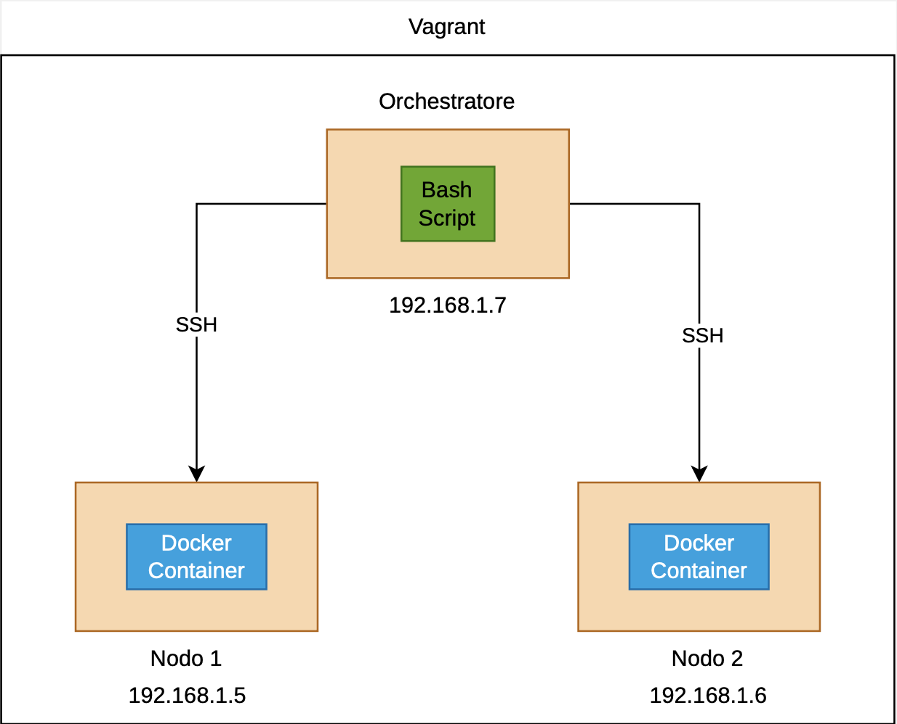

# Ping Pong
This project simulates a ping-pong game between two virtual machines. A
Docker container is started on one node for a configurable amount of
time, then stopped and started on the other node, endlessly alternating
between PING and PONG.

------------------------------------------------------------------------
## Architecture

The infrastructure consists of three **Debian** virtual machines:
<p align="center">
   
</p>

The virtual machines are managed via **Vagrant** using **VirtualBox** as the provider. Vagrant creates a private virtual network (`192.168.1.0/24`) through which the three machines communicate. The two nodes do not communicate directly with each other; instead, the orchestrator starts and stops the Docker containers to make the two machines alternate.

## Project Structure

    .
    ├── Vagrantfile
    ├── provision
    │   ├── orchestratore
    │   │   └── setup.sh
    │   └── nodi
    │       └── setup.sh
Provisioning is handled via shell, using two bash scripts: one for the orchestrator and one for the two nodes.
### Orchestrator Provisioning

The orchestrator:

1.  Updates the operating system.
2.  Generates an SSH key pair.
3.  Shares the public key with the nodes.
4.  Creates the play.sh script.

### ⚠️ Warning: The following operations are recommended for testing purposes only.

#### SSH Key Generation
```bash
ssh-keygen -t ed25519 -N "" -f /home/vagrant/.ssh/id_ed25519
```

The public key is copied to:
```bash
vagrant/orchestratore_id_ed25519.pub
```
`vagrant/` is a shared direcotry between the virtual machines and the host.
#### SSH Configuration
```text
Host 192.168.1.*
StrictHostKeyChecking no
UserKnownHostsFile=/dev/null
```
* **`Host 192.168.1.*`**: Applies the following configuration rules exclusively to any device within the `192.168.1.0/24` subnet using a wildcard (`*`).
* **`StrictHostKeyChecking no`**: Tells the SSH client to automatically accept any new or unknown remote server key. It bypasses the interactive *"Are you sure you want to continue connecting (yes/no)?"* confirmation prompt.
* **`UserKnownHostsFile=/dev/null`**: Diverts the host key storage to the system's "null device". This ensures the orchestrator instantly forgets the node's identity as soon as the session closes, preventing errors when virtual machines are destroyed and recreated with different keys.

##### Technical Impact:
This configuration bypasses all interactive confirmation prompts, enabling smooth automation during quick testing. However, it completely strips away protection against **Man-in-the-Middle (MitM)** attacks, which is why it must never be used outside a sandboxed environment.

### Nodes Provisioning

Each node:
-   Updates the system
-   Installs curl
-   Installs Docker
-   Adds vagrant to the docker group
-   Injects the orchestrator SSH public key

#### SSH Key Injection

The node checks:
```bash
if [ -f /vagrant/orchestratore_id_ed25519.pub ]
```
If the key exists:

1.  .ssh is created.
2.  authorized_keys is created.
3.  The public key is read.
4.  The key is appended only if absent.
5.  Correct permissions are restored.
```bash
chmod 700 ~/.ssh
chmod 600 ~/.ssh/authorized_keys
```
##### Why This Is Required:
SSH enforces strict security policies regarding file ownership and permissions. If the configuration files or directories are accessible by other users on the system, the SSH daemon (`sshd`) will **silently reject the keys** and fall back to password authentication, breaking the automation loop.
* **`chmod 700 ~/.ssh`**: Restricts the directory access so that **only the owner** (the `vagrant` user) can read, write, and enter it (`rwx------`). Group and public permissions are completely stripped away to prevent unauthorized users from viewing the SSH configuration.
* **`chmod 600 ~/.ssh/authorized_keys`**: Restricts the file containing trusted public keys so that **only the owner** can read and write to it (`rw-------`). This ensures that no other process or user on the machine can inject unauthorized keys into your trusted list.

#### Passwordless SSH becomes available:
```bash
ssh vagrant@192.168.1.5
ssh vagrant@192.168.1.6
```

## The play.sh Script

`play.sh` is the heart of the project.

It:

-   connects to the nodes via SSH;
-   starts a Docker container on one node;
-   waits for a configurable amount of time;
-   stops the container;
-   starts it on the other node;
-   repeats forever.

### Docker Container
```text
Image : ealen/echo-server:latest
Name  : echo-server
Port  : 8080:80
```
### CLI Arguments Management

The orchestrator script uses the native Linux **`getopt`** utility to parse command-line arguments. This allows the script to accept both short options (single hyphen, e.g., `-t`) and long options (double hyphen, e.g., `--time`), ensuring a standard and robust user interface.

#### 1. Time Duration (`-t` or `--time`)
Overrides the default round duration (which is initialized at 30 seconds).
  ```bash
  ./play.sh -t 10
  # Or using the long flag:
  ./play.sh --time 10
  ```
Sets time duration to 10 seconds.

#### 2. First Node Custom Name (`--n1`)
Allows the user to customize the display name for the first node (VM IP `192.168.1.5`). If not specified, it defaults to `"macchina 1"`.
  ```bash
  ./play.sh --n1 Tom
  ```

#### 3. Second Node Custom Name (`--n2`)
Functions exactly like `--n1`, but applies to the second node (VM IP `192.168.1.6`). It overrides the default name `"macchina 2"`.

  ```bash
  ./play.sh --n2 Jerry
  ```

#### 4. Help Menu (`-h` or `--help`)
Prints a quick usage guide detailing the correct syntax and available flags. It terminates the script immediately with a success code (`exit 0`) without starting the ping-pong routine.
  ```bash
  ./play.sh -h
  ```

#### 5. End of Options Delimiter (`--`)
 This is a standard delimiter generated by `getopt` to signify that all arguments have been parsed. The `shift` command discards the `--` flag, and `break` exits the loop, allowing the script to safely proceed to environment cleanup and the main execution loop.

---

### Internal Functions

-   countdown(): displays a countdown.
-   stop_container(): stops and removes the container remotely.
-   start_container(): starts the container, waits and stops it.

### Starting the Environment
```bash
vagrant up
vagrant ssh orchestratore
./play.sh
```
### Example Output
```text
Preparazione tavolo da gioco...
Passaggio palla a macchina 1(192.168.1.5)
macchina 1: PING
macchina 1: [30 s] remaining...
Tempo Scaduto!
Fermo macchina 1
```
### Notes
The SSH configuration intentionally sacrifices security for simplicity
and should only be used in isolated environments.